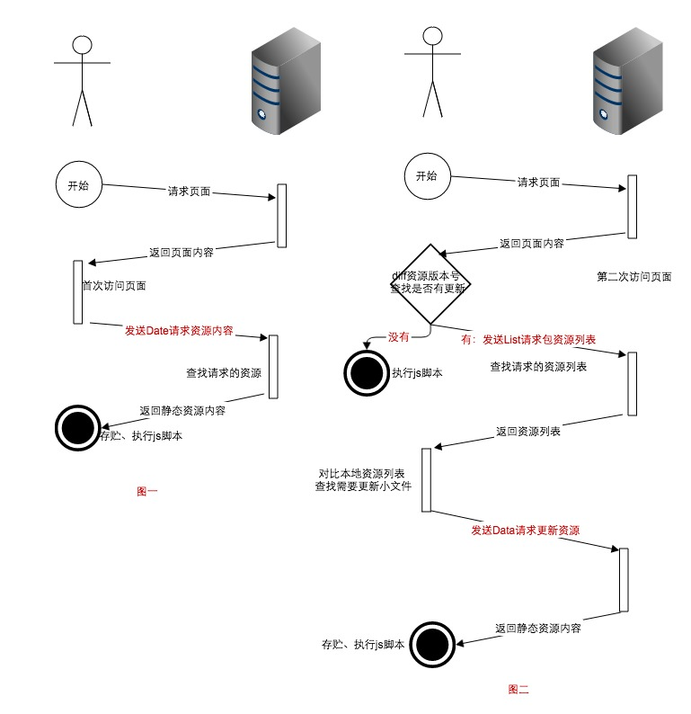

## 设计目标

* 实现静态资源增量更新(只更新修改的内容)
* 提供 dev、pro 两种资源更新模式
* 提供统计接口，衡量增量更新方案的使用状况和运行收益

## 资源更新流程图

下面两张图描述了静态资源更新的完整流程。

* 图一是当用户首次访问没有缓存的资源更新流程

		从图一中可以看出首次访问的用户资源更新需要发送1个请求

* 图二是非首次访问用户的资源更新流程

		从图二可以看出非首次访问的用户资源更新需要发送0个或者2个请求

## 模块设计

模块设计包括以下几部分：[前端框架](https://github.com/fex-team/mod)、[后端资源更新服务](https://github.com/wangcheng714/fis-localstorage-php-backend)以及其他包括调试、统计等部分。

下面大概描述了每个模块的功能作用，详细设计[参考这里](./localStorage-diff-design.text)

### 前端(组件化+增量更新)框架

前端框架负责资源的组件化以及静态资源的diff、更新、存贮、执行等工作。

### 后端服务支持

后端资源更新服务主要分为两部分：

* 后端运行时插件支持

		分析页面资源使用情况，自动生成资源更新请求

* 后端资源更新服务

		资源更新服务主要为前端框架提供资源更新的列表以及需要更新的资源内容。

### 其他模块

#### 统计与收益

* 目标

		1. 衡量增量下载方案的使用情况、以及该方案所带来的收益
		2. 统计运行中的一些数据，为后续方案升级提供数据支撑
* 数据

每次请求页面需要统计下列数据：

		1. 原方案的资源请求个数和新方案的请求个数
		2. 原方案的需要更新的资源大小和新方案的更新资源大小
		3. 原方案的字节缓存使用率和新方案的字节缓存使用率
		4. 统计各种异常。

字节缓存使用率 ： 总的资源大小当中有多少字节是来自于缓存的。

* 方式

前端框架负责数据采集、统计
		
		提供F.setFid和F.setRate设置产品线id和数据采样率
		
结合DP平台，进行数据分析、展示
		
		http://static.tieba.baidu.com/tb/pms/img/st.gif?dv=3&master=fis-lsdiff&&product=tieba-pc&type=0&c_pv=1&c_bsize=*&c_asize=*&c_bnum=&c_anum=*&c_bcache=*&c_acache=*
		c_bsize :  原方案需要请求的大小
		c_asize :  新方案需要请求的大小
		c_bnum : 原方案的请求个数
		c_anum : 新方案的请求个数
		c_bcache : 原方案的字节缓存使用率
		c_acache : 新方案的字节缓存使用率
	
* 收益

		节省请求个数对比
		节省资源大小对比 ： 转化为带宽。
		缓存使用率对比
		
#### 调试

支持url设置debug参数调试。资源加载由以下两种模式：pkg、file：

/index?debug=pkg

/index?debug=file

	pkg模式 ： 所有静态资源包通过script和style标签请求
	file模式 ： 所有静态资源打散通过script和style请求单个静态资源

#### 兼容

* localStorage禁用

		对于localStorage禁用的浏览器采用兼容方案：直接通过script请求资源合并包。

* localStorage存满(情况比较少见)

**跨域存贮或者websql，待进一步调研确认**

#### 跨域

如果前端请求和后端更新服务不再同一个域名，会存在跨域问题。通过服务器设置来解决：

	Access-Control-Allow-Origin:*
